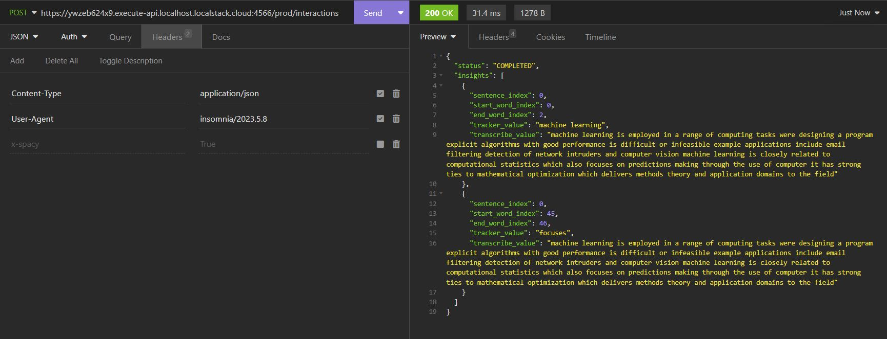
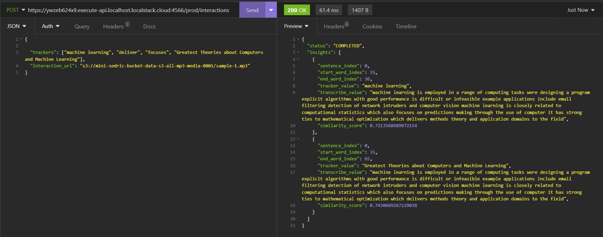
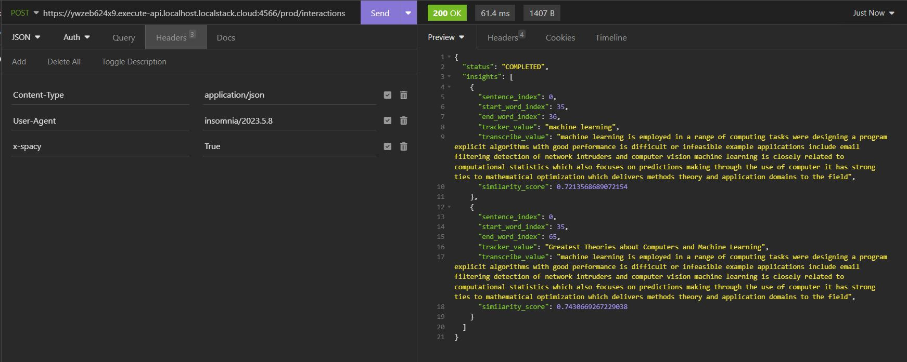
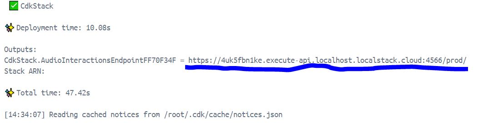
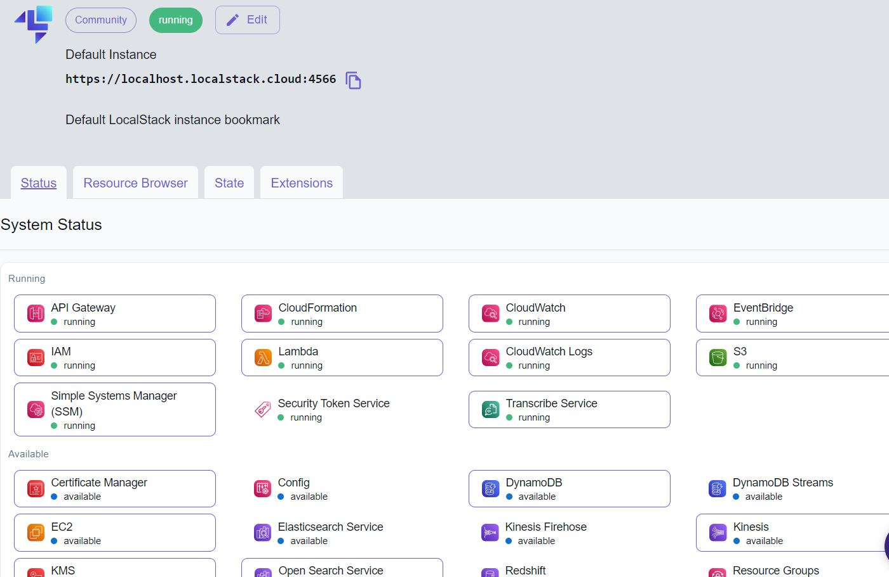
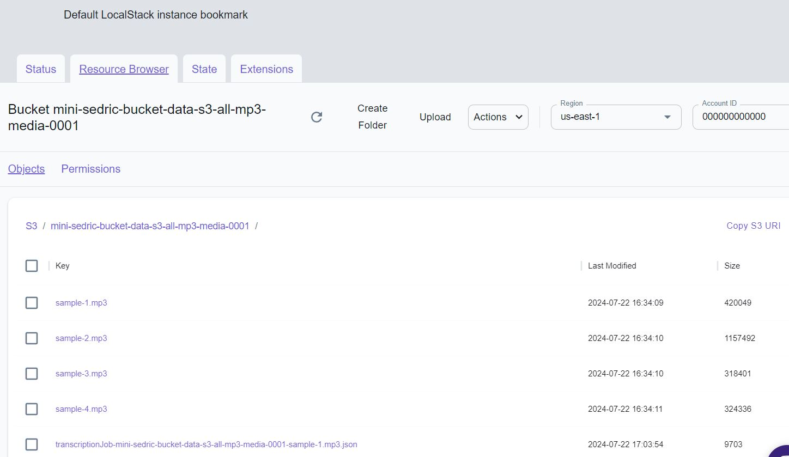

# MiniSedric

MiniSedric is a minimal backend service designed to analyze human interactions from audio files. This project provides an API that processes audio interactions in the form of MP3 files by transcribing them, extracting insights, and returning those insights in a structured format. The entire infrastructure is set up using AWS CDK (Cloud Development Kit), allowing the infrastructure to be defined and provisioned as code on AWS.

## Simplified Setup and Deployment
The entire setup and deployment process is built using Docker and Docker Compose to ensure an easy and streamlined experience. With just a simple docker-compose up command, you can have the entire infrastructure running locally or in the cloud.

## Project Overview

The service utilizes AWS infrastructure to handle audio transcription and storage:
- **AWS S3** for storing audio files.
- **AWS Transcribe** for converting audio to text.
- **AWS Lambda** for orchestrating the process of transcription and insight extraction.
- **AWS API Gateway** for providing an HTTP endpoint to interact with the Lambda functions.
- **AWS IAM** for providing credentails.


Additionally, I have implemented the solution on a test AWS cloud using LocalStack (https://www.localstack.cloud/), which is a convenient way to test and experiment as it mirrors normal AWS services.

For infrastructure as code, I have used AWS CDK, allowing me to write the entire application in Python, to implement AWS services mentioned above, including AWS API Gateway, S3, Lambda, Transcribe, and IAM.

## Code Quality
To ensure code quality, the project includes the following tools and standards:

- **black**: Automatically formats Python code according to PEP 8 standards.
- **flake8**: Checks code linting to enforce coding standards and style.
- **isort**: Organizes imports according to PEP 8 standards.
These tools are integrated into the project and can be easily run using make commands.

### Features

- **Transcription**: Converts MP3 files into text using AWS Transcribe.
- **Insight Extraction**: Extracts specified values from the transcribed text using regular expressions and Spacy NLP (https://spacy.io/).
- **API Gateway**: Provides an HTTP endpoint for interaction.
- **API Response**: Returns insights in a structured JSON format.

## Setup Instructions

### Prerequisites

- **Internet Connection**
- **Docker Desktop**: Ensure Docker and Docker Compose are installed and running. For Windows users, WSL2 is required. Please refer to the Docker installation guide (https://www.docker.com/products/docker-desktop/).
- **Tool to test the endpoint**: You can use tools like Postman (https://www.postman.com/), Insomnia (https://insomnia.rest/), curl, or any other tool capable of making POST requests with a JSON body.
- **Git**: Ensure you have git (https://git-scm.com/) installed.


## How to Run the Project

#### 1. Clone the Repository

```bash
git clone https://github.com/artursniegowski/MiniSedric
cd minisedric
```

#### 2. Configure Environment Variables
Rename the folder **.envs/.example**  ->  **.envs/.dev** and adjust the environmental variables if necessary.

#### 3. Build and Run the Project
If you have make installed, you can use the following commands:
```bash
make build
make up
```

Alternatively, if you don't have make installed, you can use Docker Compose directly:
```bash
docker-compose build
docker-compose up -d
```

## Testing the AWS Services - Making the Requests
Once the infrastructure is deployed, you can retrieve your URL endpoint from the Docker logs and start testing.

#### You can make POST requests to retrieve insights with a direct match using regex, where trackers will be searched for.

 


 


#### To retrieve insights based on trackers with the Spacy.io NLP models, you can make a POST request with the header x-spacy = True.


 


 


## Important - Good to know

#### 1. The **/cdk/media** directory contains sample MP3 files that can be requested by the endpoint. Feel free to add other MP3 files to test it. These files get auto-discovered and will be automatically copied to your test S3 bucket by the build process. Make sure you use MP3 files as only they are allowed. There are implemented validations preventing the use of different file types.

#### 2. Your Docker Compose setup will spin up two containers: one for LocalStack (used for simulating AWS services) and one for the CDK container (responsible for setting up the whole infrastructure). There will also be a Lambda containers dynamically spun up as requests are made to the test endpoint, but the Lambda container will shut down after max 15 minutes.

#### 3. After starting docker-compose up -d, the CDK container will start deployment. Once it finishes, the container will exit. This is when you should open the container with Docker Desktop and retrieve the endpoint URL that you will need for testing the Lambda function. Check the logs of the *minisedric-cdk* container, you should find something like this:
 


#### 4. After retrieving the endpoint from the CDK container, and once the provisioning is finished (indicated by the container's exit status and logs showing the build succeeded), you can copy this endpoint.
(this is just an example): 
```bash
https://od3n0ygx76.execute-api.localhost.localstack.cloud:4566/prod
```

Next, to reach your API gateway, please add /interactions to it like so:
```bash
https://od3n0ygx76.execute-api.localhost.localstack.cloud:4566/prod/interactions
```

#### 5. Every time you run your CDK container to deploy the infrastructure to LocalStack, the endpoint URL may change. Therefore, you need to confirm the URL each time you deploy, as shown in point 4. With LocalStack, the endpoint URL changes dynamically:
```bash
https://<auto-generated>.execute-api.localhost.localstack.cloud:4566/prod/interactions
```
On AWS, the endpoint URL for your API Gateway will remain consistent as long as the API Gateway configuration is not changed.

#### 6. The endpoint will only accept POST requests with a JSON payload that looks as follows:
```json
{
  "trackers": ["tracker-1", "tracker-2"],
  "interaction_url": "s3://mini-sedric-bucket-data-s3-all-mp3-media-0001/<your_file_name_as_in_cdk_media_folder>",
}
```
Make sure that the trackers parameter is a list of strings and that the interaction_url is a string representing a valid S3 URI. Validation and sanitization for these parameters have been implemented.

The API Gateway will also validate that the incoming data is a valid JSON payload. Ensure that the data is formatted correctly.

Optionally, you can add "x-spacy" = True in the header of the request to use Spacy.io for extracting trackers. If the "x-spacy" header is not provided, the extraction will be done using an exact regex match.


#### 7. Makefile Commands: The project includes a Makefile with basic commands for managing Docker containers and code quality:

- **make flake8**: Checks code linting.
- **make isort**: Organizes imports according to PEP 8 standards.
- **make black**: Formats Python code according to PEP 8 standards.
- **make format**: combines black, isort and flake8 in one single command.
- Additional commands are provided for building, running, and deploying using Docker.


#### 8. After provisioning is complete, you can visit LocalStack's dashboard (https://www.localstack.cloud/), sign in, and view all your configured AWS services. From the dashboard, you can monitor and interact with these services in real time.


 


 


#### 9. Be patient: The building process and CDK deployment might take a few minutes to finish.

#### 10. Be patient during initial testing. The first request may take a few seconds to process as AWS Lambda needs to spin up the container and load dependencies related to Spacy, which includes a large amount of data. This latency can be mitigated by introducing provisioned concurrency with Lambdas to keep instances warm and ready to handle requests immediately. Depending on the project's requirements and specifications, this could be desirable or not, as implementing provisioned concurrency would result in higher AWS costs to run the service.